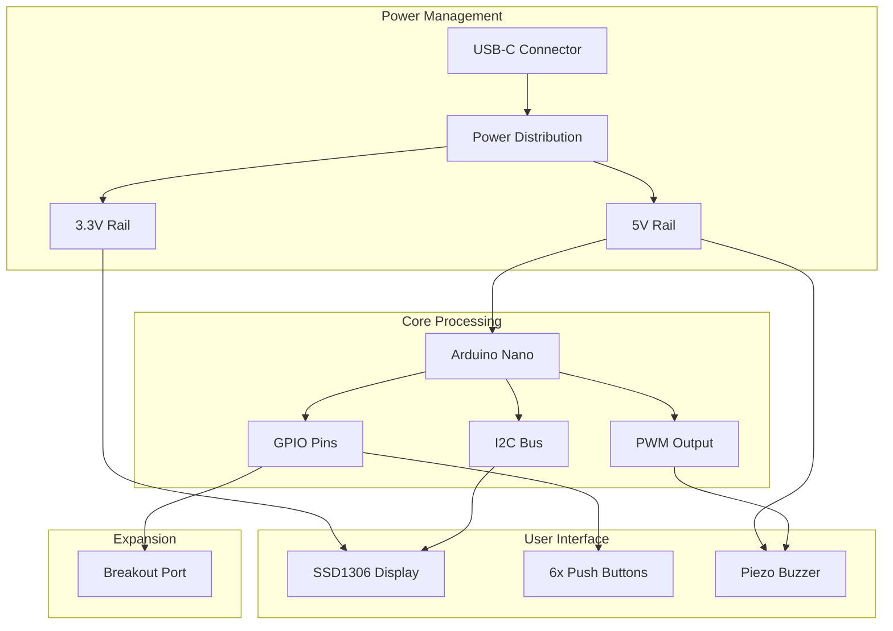

# PCB Board Design Document

## Overview

The MinuxStation PCB is a compact 4-layer board designed to integrate an Arduino Nano with essential gaming components. The design prioritizes signal integrity, power distribution, and user-friendly assembly while providing a solid foundation for the educational RTOS gaming platform. The board measures 60mm x 40mm to maintain a handheld form factor and uses a mix of through-hole and surface-mount components for optimal balance between assembly difficulty and space efficiency.

## Architecture

### System Architecture



### Electrical Architecture

The board uses a 4-layer stackup with dedicated power and ground planes for optimal signal integrity and power distribution. The Arduino Nano serves as both the processing unit and power regulator, with the 5V USB power feeding the Arduino's onboard regulator to provide 3.3V for the OLED display. The dedicated power planes (Int1 GND, Int2 PWR) provide clean power distribution and excellent EMI shielding.

## Components and Interfaces

### Arduino Nano Integration

**Mounting**: The Arduino Nano is mounted using female pin headers (2x15 pins) allowing for easy replacement and programming access. The board provides mechanical support through proper header spacing and optional mounting holes.

**Power Distribution**: 
- VIN pin receives 5V from USB-C connector via Int2 PWR plane
- 5V pin supplies power to buzzer and expansion port through power plane
- 3.3V pin supplies power to OLED display via power plane distribution
- GND connections utilize dedicated Int1 GND plane for low impedance ground return

**Pin Allocation**:
- Digital pins D2-D7: Push buttons (with internal pull-ups)
- Digital pins D8: Buzzer (PWM capable)
- Analog pins A4 (SDA), A5 (SCL): I2C for OLED
- Remaining pins: Routed to expansion port

### SSD1306 OLED Display

**Connection**: 4-pin I2C interface (VCC, GND, SDA, SCL)
- VCC: Connected to 3.3V rail with 100nF decoupling capacitor
- GND: Connected to ground plane
- SDA: Connected to Arduino A4 with 4.7kΩ pull-up resistor
- SCL: Connected to Arduino A5 with 4.7kΩ pull-up resistor

**Mounting**: Standard 0.96" OLED module footprint with 4-pin header or direct soldering option

### Push Button Array

**Configuration**: 6 tactile switches (6x6mm) arranged in a 2x3 grid for ergonomic access
- Each button connected between Arduino digital pin and ground
- Arduino internal pull-up resistors utilized (no external resistors needed)
- 100nF ceramic capacitors for hardware debouncing on each button

**Layout**: Positioned on the left side of the board for thumb operation:
```
[BTN1] [BTN2]  (D2, D3)
[BTN3] [BTN4]  (D4, D5)
[BTN5] [BTN6]  (D6, D7)
```

### Piezo Buzzer

**Connection**: Active 5V buzzer connected to digital pin D8 (PWM capable)
- Positive terminal: Connected to D8 through 100Ω current limiting resistor
- Negative terminal: Connected to ground
- Optional: Flyback diode (1N4148) for protection

**Mounting**: Standard 12mm piezo buzzer footprint with through-hole mounting

### Expansion Port

**Pin Assignment**: 2x8 pin header exposing unused Arduino pins
- Row 1: D9, D10, D11, D12, D13, A0, A1, A2
- Row 2: A3, A6, A7, 5V, 3.3V, GND, GND, RST

**Protection**: 100Ω series resistors on all signal lines for basic protection
**Labeling**: Clear silkscreen labeling for each pin function

### Power System

**USB-C Connector**: 
- USB-C receptacle for power and programming
- VBUS connected to Arduino VIN through polyfuse (500mA)
- Data lines (D+, D-) connected to Arduino USB interface
- Shield connected to ground plane

**Power Distribution**:
- 5V rail: USB VBUS → Polyfuse → Int2 PWR plane → Arduino VIN
- 3.3V rail: Arduino 3.3V output → Int2 PWR plane → OLED and expansion port
- Ground system: Dedicated Int1 GND plane with multiple via stitching to Top/Bottom layers

## Data Models

### Pin Configuration Map

```
Arduino Pin | Function        | Component      | Notes
-----------|----------------|----------------|------------------
D2         | Button Input   | Button 1       | Internal pull-up
D3         | Button Input   | Button 2       | Internal pull-up
D4         | Button Input   | Button 3       | Internal pull-up
D5         | Button Input   | Button 4       | Internal pull-up
D6         | Button Input   | Button 5       | Internal pull-up
D7         | Button Input   | Button 6       | Internal pull-up
D8         | PWM Output     | Buzzer         | Current limited
D9-D13     | GPIO           | Expansion Port | Series protected
A0-A3      | Analog/GPIO    | Expansion Port | Series protected
A4 (SDA)   | I2C Data       | OLED Display   | Pull-up resistor
A5 (SCL)   | I2C Clock      | OLED Display   | Pull-up resistor
A6-A7      | Analog Input   | Expansion Port | Analog only
VIN        | Power Input    | USB-C          | Polyfuse protected
5V         | Power Output   | Expansion      | Current limited
3.3V       | Power Output   | OLED/Expansion | Arduino regulator
GND        | Ground         | All Components | Ground plane
```

### Component Specifications

| Component | Part Number | Package | Value/Rating | Tolerance |
|-----------|-------------|---------|--------------|-----------|
| Arduino Nano | Compatible | DIP | 5V/16MHz | - |
| SSD1306 OLED | 0.96" I2C | Module | 128x64 | - |
| Tactile Switch | 6x6mm | THT | 50mA/12V | - |
| Piezo Buzzer | 12mm Active | THT | 5V/85dB | - |
| USB-C Connector | Type-C | SMD | 5V/3A | - |
| Pull-up Resistor | 0805 | SMD | 4.7kΩ | 5% |
| Current Limit Resistor | 0805 | SMD | 100Ω | 5% |
| Decoupling Capacitor | 0805 | SMD | 100nF | 10% |
| Polyfuse | 1206 | SMD | 500mA | - |

## Error Handling

### Electrical Protection

**Overcurrent Protection**: 
- Polyfuse on USB input (500mA rating)
- Current limiting resistors on buzzer and expansion pins
- Arduino's built-in USB protection

**ESD Protection**:
- Ground plane for EMI shielding
- Proper trace routing to minimize noise
- Decoupling capacitors near sensitive components

**Reverse Polarity Protection**:
- USB-C connector inherently prevents reverse connection
- Expansion port clearly labeled for proper connection

### Manufacturing Tolerances

**PCB Specifications**:
- 4-layer stackup: Top Layer (0.035mm), Int1 GND (0.035mm), Int2 PWR (0.035mm), Bottom Layer (0.035mm)
- Dielectric layers: PP-017 prepreg (0.12954mm) and Core-039 core (0.7112mm)
- Minimum trace width: 0.1mm (4 mil) for signal layers, 0.2mm (8 mil) for power
- Minimum via size: 0.2mm (8 mil) with 0.1mm (4 mil) drill
- Board thickness: 1.6mm ±10%

**Component Placement**:
- Minimum component spacing: 0.5mm
- Keep-out zones around mounting holes
- Thermal relief for ground connections

### Assembly Error Prevention

**Silkscreen Markings**:
- Component reference designators
- Pin 1 indicators for ICs and connectors
- Polarity markings for polarized components
- Expansion port pin labels

**Mechanical Design**:
- Proper header spacing for Arduino Nano
- Component height considerations for enclosure fit
- Strain relief for USB connector

## Testing Strategy

### Design Verification

**Electrical Rule Check (ERC)**:
- Verify all nets are properly connected
- Check for floating pins and unconnected nets
- Validate power and ground connections
- Confirm pin assignments match schematic

**Design Rule Check (DRC)**:
- Verify minimum trace widths and spacings
- Check via sizes and drill specifications
- Validate component courtyard clearances
- Confirm manufacturing constraints

### Prototype Testing

**Power System Validation**:
- Measure voltage rails under load
- Verify current consumption
- Test USB-C connector functionality
- Validate polyfuse operation

**Interface Testing**:
- I2C communication with OLED display
- Button input responsiveness and debouncing
- Buzzer audio output and PWM control
- Expansion port continuity and signal integrity

**Integration Testing**:
- Arduino Nano mounting and connection
- Complete system power-up sequence
- Firmware loading and execution
- All peripherals functioning simultaneously

### Production Testing

**Automated Test Procedures**:
- In-circuit testing (ICT) for component placement
- Functional testing with test firmware
- Power consumption measurement
- Signal integrity verification

**Quality Assurance**:
- Visual inspection checklist
- Dimensional verification
- Electrical continuity testing
- Final assembly verification

### Documentation Testing

**Assembly Instructions**:
- Step-by-step assembly verification
- Component identification accuracy
- Tool requirements validation
- Troubleshooting guide effectiveness

**Design File Validation**:
- Gerber file generation and review
- Pick and place file accuracy
- Bill of materials completeness
- Manufacturing file package verification